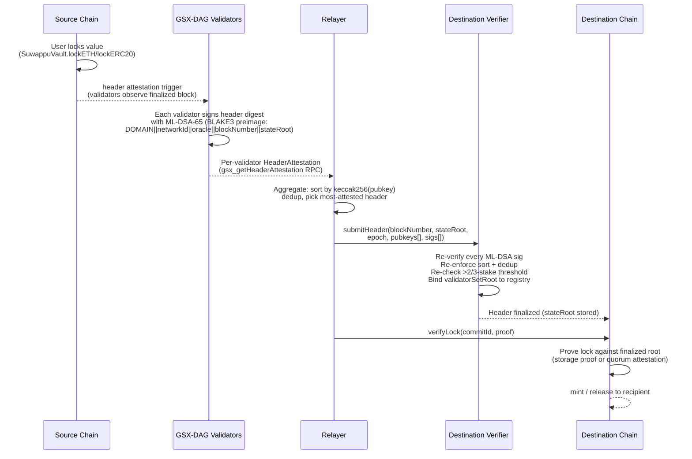
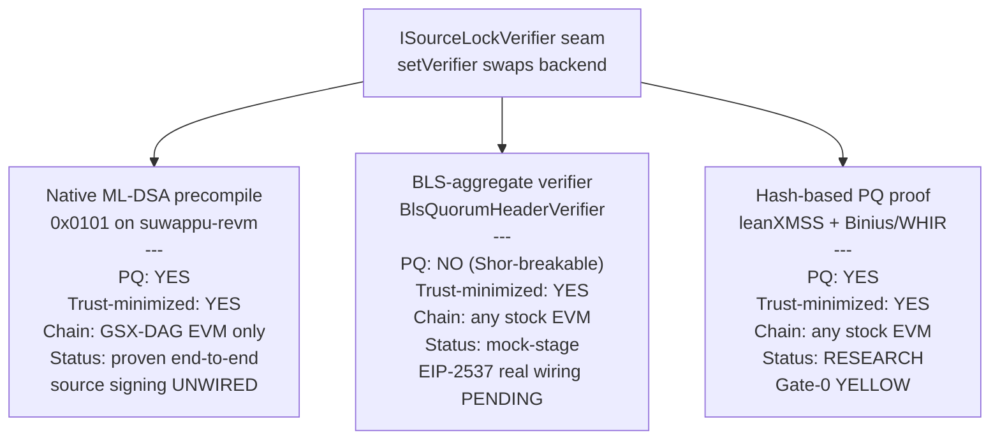
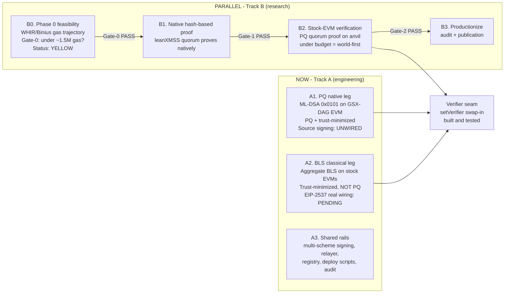

# Suwappu Bridge — Architecture Reference

**Date:** 2026-06-09 · **Status:** living document — reflects the as-built state of
`docs/architecture-refresh`. For source-side wiring gaps and remaining work see
[`docs/security/audits/suwappu/NEXT_STEPS_SOURCE_SIDE.md`](security/audits/suwappu/NEXT_STEPS_SOURCE_SIDE.md).

---

## 1. End-to-end flow

The bridge moves value between chains through a five-party flow:

**Key design choices in this flow:**

- The **relayer is liveness-trusted but cannot forge.** The on-chain verifier
  re-checks every ML-DSA signature, re-enforces the strictly-increasing
  `keccak256(pubkey)` dedup, and re-enforces the `>2/3`-stake quorum threshold.
  A malicious relayer can at most stall (withhold a header) or submit a set the
  oracle rejects. It can never finalize a header the quorum did not sign, never
  inflate stake, and never reorder past the on-chain dedup. This is implemented
  in `src/ltp/bridge/header_relayer.py` (see `HeaderRelayer.aggregate`/`submit`).

- The `>2/3`-stake threshold is integer division (`totalStake * 2 / 3 + 1`),
  matching `GsxDagValidatorRegistry._verifyQuorum` and `quorum-core/src/lib.rs`
  exactly. Signer arrays must be sorted strictly-increasing by
  `keccak256(pubkey)` — any out-of-order or duplicate entry reverts the oracle.

---

## 2. Trust model

**The bridge provides a validator-quorum side-attestation (sync-committee trust
class), NOT a consensus light client and NOT trustless.**

Correctness rests on an honest `>2/3`-stake quorum of the tracked GSX-DAG
validator set. "Honest" here means: the quorum signs headers that faithfully
reflect the source chain's finalized state. There is no consensus-rule coupling
(no Mysticeti-C commit-rule reconstruction), no slashing for bridge-specific
equivocation (beyond the on-chain equivocation guard that reverts a conflicting
root for a finalized block), and no proof of source-chain state.

**The iron triangle.** The bridge faces a hard three-way constraint:

| Property | Can achieve on? |
|---|---|
| Post-quantum (PQ) | GSX-DAG EVM (we control the VM) |
| Trust-minimized | Any chain with the right verifier |
| Stock EVM (no custom VM) | Pick classical (BLS) or wait for Track B |

All three at once on a stock EVM requires a PQ-native proof system that does not yet
exist in production. The dual-track plan addresses this directly.

---

## 3. The verifier seam

Every verification route funnels through **one primitive-agnostic seam**: the
on-chain quorum verifier that (a) checks a proof/signature-set and (b) binds the
committed `validatorSetRoot` to the on-chain registry, then finalizes the header.
`setVerifier` swaps the backend; the custody layer (vault, mint adapter, storage
proof) is unchanged.

### Native ML-DSA precompile path — PQ and trust-minimized

The destination contracts deployed on the **GSX-DAG EVM** (`suwappu-revm`) verify
ML-DSA-65 signatures via native precompile `0x0101` and BLAKE3 hashing via `0x0102`.
This is the only path that is **both post-quantum and trust-minimized**. The
precompile integration has been proven end-to-end (real ML-DSA-65 verified on-chain
in suwappu-revm). The contract suite (`GsxDagQuorumHeaderOracle` +
`GsxDagValidatorRegistry`) is built and waiting.

**Current gap:** GSX-DAG validators do not yet sign header attestations (the signing
duty is unimplemented). The oracle exists but is inert without source signers. See
`NEXT_STEPS_SOURCE_SIDE.md` §2.A for the exact implementation spec, and the
wired-vs-unwired matrix at §3.2 for the full picture of what is live today.

**What ships live today:** single-key ECDSA custody (`SuwappuEcdsaMintVerifier`).
Every trust-minimizing alternative is code-present but unwired.

### BLS-aggregate path — trust-minimized, classical (Track A legacy leg)

`BlsQuorumHeaderVerifier` provides trust-minimized header finality on **stock EVMs**
using BLS12-381 aggregate signatures. The validators already hold BLS12-381 keys
(LTP/fast-path); one aggregate verify is cheap on-chain.

**PQ status: NOT post-quantum.** BLS12-381 is Shor-breakable on a
cryptographically-relevant quantum computer. This is the documented **Track A
exception zone** — pragmatic reach to stock EVMs, classical security, with
EIP-8051 / Track B as the PQ migration target.

**Current status: mock-stage.** Real EIP-2537 wiring is pending (PR #21). Three
blockers remain before the real path can carry value: (1) rogue-key attack
protection (proof-of-possession per pubkey at registration, or message
augmentation); (2) uncompressed G1 point format for EIP-2537 G1ADD; (3) validator
set cap widening past 256. The mock test suite proves registry-binding and
set-consistency only.

### Hash-based PQ proof (Track B) — PQ and trust-minimized on stock EVMs

The north-star goal: the **first end-to-end post-quantum trustless bridge verifier
on a foreign stock EVM**. The core bet is **leanXMSS (hash-based signatures) +
Binius/WHIR (hash-based proof system)** — hash-based all the way down, no elliptic
curves, nothing Shor can break, and exactly what the EF's Lean Ethereum initiative
is building for L1 consensus.

**Status: RESEARCH.** Gate-0 (WHIR/Binius EVM-verifier gas trajectory under
~1.5 M gas) is the kill gate — the current anchor is ~5.6 M gas, with an active
optimization trajectory. This is a 12–18 month research bet that needs a
cryptographer; detailed plan in
[`PQ_STOCK_EVM_RESEARCH_PLAN.md`](security/audits/suwappu/PQ_STOCK_EVM_RESEARCH_PLAN.md).

### SP1-Groth16 quorum proof — blocked and classical

An SP1 circuit wrapping ML-DSA-65 quorum verification (`zkvm/sp1-quorum-verifier`)
would allow any EVM to verify the quorum for ~300k gas. **Two reasons it is not
the production path:** (1) SP1 hits a 2 GB-heap wall on multi-sig ML-DSA proving,
making it impractical for a full quorum; (2) the BN254 Groth16 wrapper is
Shor-breakable, so this path is **NOT post-quantum** even though the inner ML-DSA
signatures are. Useful for single-sig proofs and testing; not the bridge endgame.

---

## 4. Dual-track roadmap

**Track A** is pure engineering, drivable now. Exit = a mainnet-safe, audited,
trust-minimized bridge: PQ settlement on the GSX-DAG EVM (A1), classical-but-
trust-minimized BLS leg to legacy stock EVMs (A2), over shared rails (A3).

**Track B** is a research bet. The two tracks share the same seam — when Track B
clears its gates, it ships as a drop-in `setVerifier` upgrade into an already-live
system, not a rewrite. The parallelism is free of contention because A and B touch
different layers: A builds rails + classical/native verify; B builds the PQ proof;
they meet only at the seam.

---

## 5. Per-path honest status summary

| Path | PQ? | Trust model | Status |
|---|---|---|---|
| Native ML-DSA (0x0101) on GSX-DAG EVM | YES | >2/3-stake quorum | Proven end-to-end; source signing UNWIRED |
| BLS aggregate on stock EVMs | NO (classical) | >2/3-stake quorum | Mock-stage; EIP-2537 + PoP pending (PR #21) |
| Hash-based PQ proof (Track B) | YES | >2/3-stake quorum | Research; Gate-0 YELLOW |
| SP1-Groth16 quorum proof | NO (BN254 classical) | Removes relayer/liveness trust | Blocked (2GB-heap); not the bridge path |
| Single-key ECDSA | NO | 1 operator key | LIVE today — the actual wired default |

**The single-key ECDSA row is what ships today.** Every trust-minimizing
alternative is code-present but unwired; the two strongest (native ML-DSA, BLS)
are also unsupplied by the source chain. Independent audit + funded bug bounty are
hard preconditions before any real funds.

---

## 6. Key source files

| Component | Path |
|---|---|
| GSX-DAG quorum header oracle | `contracts/src/verifiers/GsxDagQuorumHeaderOracle.sol` |
| GSX-DAG validator registry | `contracts/src/verifiers/GsxDagValidatorRegistry.sol` |
| BLS quorum header verifier (Track A) | `contracts/src/verifiers/BlsQuorumHeaderVerifier.sol` |
| Storage-proof source-lock verifier | `contracts/src/verifiers/StorageProofSourceLockVerifier.sol` |
| SP1 Helios header oracle | `contracts/src/verifiers/Sp1HeliosHeaderOracle.sol` |
| Quorum-core (shared logic) | `zkvm/quorum-core/` |
| SP1 quorum verifier circuit | `zkvm/sp1-quorum-verifier/` |
| Off-chain header relayer | `src/ltp/bridge/header_relayer.py` |
| Source-side wiring roadmap | `docs/security/audits/suwappu/NEXT_STEPS_SOURCE_SIDE.md` |
| Dual-track plan | `docs/security/audits/suwappu/DUAL_TRACK_PQ_BRIDGE_PLAN.md` |
| Track B research plan | `docs/security/audits/suwappu/PQ_STOCK_EVM_RESEARCH_PLAN.md` |
| Remaining gaps (source-side gaps) | `docs/security/audits/suwappu/REMAINING_GAPS_RESEARCH.md` |
